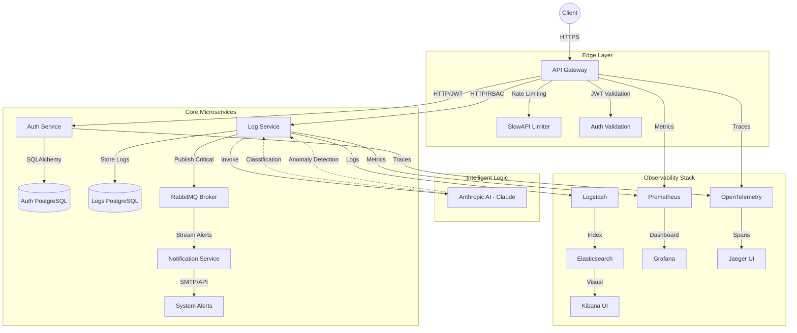

# UYG414 Microservice Ecosystem — Cumulative Development

This repository documents the evolution of a production-grade microservice ecosystem focused on log management, security, and AI-driven insights. It has been developed in five distinct stages, each introducing critical engineering concepts from infrastructure automation to advanced semantic intelligence.

---

## 🏗 System Architecture (UML)

---

## 🛠 Project Stages

### Stage 1 — HW#1: The Core Foundation
The first stage established the core logic of the system as a monolithic API. 
- **4-Layer Architecture**: I implemented a robust clean-code pattern separating the API (Controllers), Services (Logic), Repositories (Data Access), and Models (Schemas). This ensured testability and future scalability.
- **AI Integration**: I integrated **Anthropic Claude** to automatically classify error logs into categories like `DATABASE_ERROR` or `AUTH_ERROR`, providing instant root-cause context.
- **Persistence**: Used PostgreSQL with SQLAlchemy ORM for reliable, transactional log storage.

### Stage 2 — HW#2: Distributed Microservices
In this stage, the monolith was refactored into a suite of decoupled microservices to improve fault tolerance and team autonomy.
- **API Gateway**: Created a central entry point that handles all routing and applies global security checks (JWT validation).
- **Asynchronous Communication**: Integrated **RabbitMQ** to allow the Log Service to broadcast critical errors to the Notification Service without blocking the main request flow.
- **JWT Authentication**: Implemented a secure identity provider (`auth_service`) that issues signed tokens, allowing stateless authorization across all services.

### Stage 3 — HW#3: Cloud Infrastructure & CI/CD
Stage 3 prepared the system for production-level deployment.
- **Containerization**: Every service was containerized using Docker, with multi-stage builds to minimize image size and security surface area.
- **Orchestration**: Developed Kubernetes manifests (`k8s/`) to manage deployments, horizontal scaling, and secure networking within a cluster.
- **CI/CD Pipeline**: Built a **GitHub Actions** workflow that automates the development lifecycle: it runs `pytest` suites on every push and builds/validates Docker images to prevent regressions.

### Stage 4 — HW#4: Observability & Reliability
This stage added deep visibility into the system's performance and improved its resilience.
- **The ELK Stack**: Integrated Elasticsearch, Logstash, and Kibana for centralized logging. Logs are now searchable across all services in real-time.
- **Monitoring & Tracing**: Used **OpenTelemetry** and **Prometheus** to map request flows and visualize metrics (request/sec, error rates) in Grafana.
- **Fault Tolerance**: Implemented "Self-Healing" health checks and **Tenacity retries** at the Edge Gateway, allowing the system to automatically recover from transient network failures.

### Stage 5 — HW#5: Advanced Security & AI
The final stage introduced hardened security measures and shifted from reactive to predictive AI.
- **RBAC (Role-Based Access Control)**: Implemented fine-grained permissions. Tokens now include roles which the Gateway propagates to downstream services to strictly enforce access rights.
- **Distributed Rate Limiting**: Added `slowapi` to the Gateway to prevent Denial-of-Service (DoS) attacks and ensure fair resource usage across all users.
- **AI Anomaly Detection**: Upgraded the AI logic from simple classification to **predictive pattern analysis**. The system now analyzes historical logs semantically to identify unusual security patterns (like brute-force or injection attempts) before they cause a full system breach.

---

## 🚀 Presentation Highlights

| Feature | Technology | Value Proposition |
| :--- | :--- | :--- |
| **Logic** | Python 3.11 / FastAPI | High-performance, async-native execution. |
| **Identity** | JWT / bcrypt / RBAC | Secure, horizontally scalable authentication. |
| **Messaging** | RabbitMQ / aio-pika | Event-driven architecture for low latency. |
| **Observability**| ELK / OTEL / Jaeger | Full-stack visibility and distributed tracing. |
| **AI** | Claude-3 (Anthropic) | Semantic intelligence for log analysis and security. |
| **Deployment** | Docker / K8s / GHA | Modern DevOps pipeline and orchestration. |

---

## 📂 Repo Structure Summary
- `hw1-5/` — Historical stage snapshots.
- `project/` — The complete, latest version of the ecosystem.
- `.github/` — Source for the automated CI/CD pipeline.
