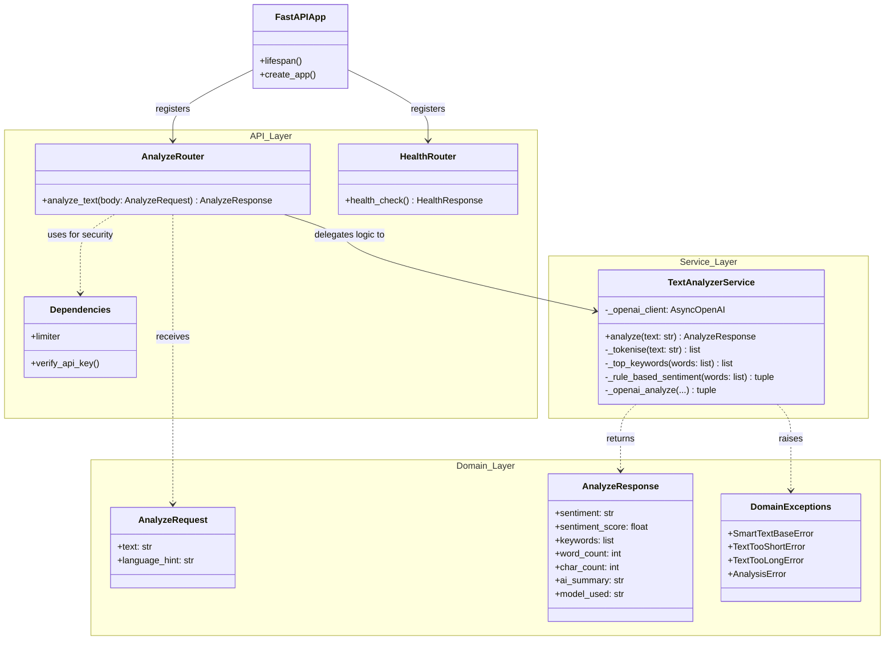

# SmartText API

UYG414 — HW#1

A simple API built with FastAPI that analyzes text. Send it some text, and it returns the sentiment, top keywords, and word/character counts. 

If you put an OpenAI key in the `.env` file, it will also use GPT-4o-mini to write a short summary. Without a key, it still works fine using a basic rule-based sentiment checker.

---

## How the code is organized



- **api/** - Handles the web requests and security (auth, rate limits)
- **services/** - Does the actual text analysis (no web stuff here)
- **domain/** - Defines the data models and custom errors
- **core/** - Setup for config, logging, and metrics

---

## How to run it

### Option 1: Just Python

1. Create a virtual environment and install packages:
```bash
python -m venv .venv
.venv\Scripts\activate          # on Windows
# source .venv/bin/activate     # on Mac/Linux

pip install -r requirements.txt
```

2. Copy the config template:
```bash
copy .env.example .env
```

3. Start the app:
```bash
uvicorn app.main:app --reload
```
Now it's running at `http://localhost:8000`. You can see the docs at `/docs`.

### Option 2: Docker
```bash
docker-compose up --build
```
This spins up the API on port 8000 and Prometheus on port 9090.

---

## Using the API

### 1. Check if it's up
```bash
curl http://localhost:8000/api/v1/health
```

### 2. Analyze text
You need to pass the `X-API-Key` header (the default is `dev-secret-key`).

```bash
curl -X POST http://localhost:8000/api/v1/analyze \
  -H "X-API-Key: dev-secret-key" \
  -H "Content-Type: application/json" \
  -d '{"text": "FastAPI is a great framework for building REST APIs in Python!"}'
```

**What you get back:**
```json
{
  "sentiment": "positive",
  "sentiment_score": 0.3571,
  "keywords": ["fastapi", "great", "framework", "building", "rest"],
  "word_count": 11,
  "char_count": 65,
  "ai_summary": null,
  "model_used": "rule-based-mock"
}
```

---

## Tests and CI/CD

To run the tests locally:
```bash
pytest tests/ -v
```

All 24 tests should pass without needing an internet connection or API keys.

Every time code is pushed to GitHub, a GitHub Actions workflow runs. It checks the code style with `ruff`, runs the tests with `pytest`, and does a test Docker build to make sure nothing is broken.
