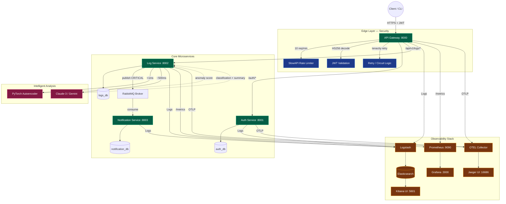

<div align="center">

# Log Intelligence Platform
### A Production-Grade Microservice Ecosystem for AI-Driven Log Security & Observability

**UYG414 — Special Topics in Computer Engineering · Final Project**

[](https://www.python.org/)
[](https://fastapi.tiangolo.com/)
[](https://www.docker.com/)
[](https://kubernetes.io/)
[](https://www.postgresql.org/)
[](https://www.rabbitmq.com/)
[](https://www.elastic.co/elastic-stack)
[](https://pytorch.org/)
[](https://www.anthropic.com/)
[](https://github.com/features/actions)

</div>

---

## 1. The Problem

> Modern distributed systems generate **millions of log lines per day**. Buried inside that noise are the early signals of outages, breaches, and abuse — but humans cannot read them in time.

Engineering teams today face three painful realities:

| Pain Point | Impact |
| :--- | :--- |
| **Log Volume Explosion** | Critical errors get lost in millions of routine `INFO` lines. |
| **Reactive Security** | Threats are detected *after* damage is done — alerts fire post-breach. |
| **Tool Sprawl** | Teams juggle separate tools for logging, auth, alerting, and monitoring with no unified semantic context. |

**The cost?** Mean Time To Detect (MTTD) and Mean Time To Respond (MTTR) climb, while engineers drown in dashboards.

---

## 2. The Solution

A **unified, AI-augmented microservice platform** that ingests logs from any service, performs **two-tier intelligent analysis** in real time, and surfaces only the signals that matter — with full security, observability, and DevOps tooling baked in.

### Core Idea: A Two-Tier AI Pipeline

```
                    ┌──────────────────────────────────────────┐
   Raw Log  ──────▶ │  Tier 1: PyTorch Autoencoder  (<1 ms)    │ ──▶ anomaly score
                    │  → instant structural anomaly scoring    │
                    └──────────────────┬───────────────────────┘
                                       │ if score high OR level ∈ {ERROR, CRITICAL}
                                       ▼
                    ┌──────────────────────────────────────────┐
                    │  Tier 2: Claude-3 / Gemini  (~500 ms)    │ ──▶ classification
                    │  → semantic root-cause classification    │     + summary
                    │  → cross-log threat pattern analysis     │     + severity
                    └──────────────────────────────────────────┘
```

This **fast/slow lane split** keeps p99 latency tight while reserving expensive LLM calls for logs that actually matter — combining the speed of local ML with the reasoning depth of a frontier model.

---

## 3. What It Actually Does — Demo Flow

A live walkthrough of the platform in 5 steps:

| # | Action | What Happens Behind the Scenes |
| :-: | :--- | :--- |
| 1 | User registers + logs in via CLI dashboard | `auth_service` issues signed JWT (access + refresh) |
| 2 | A microservice POSTs a log to `/api/v1/logs/ingest` | API Gateway validates JWT, enforces RBAC, rate limits, forwards |
| 3 | `log_service` runs **PyTorch Autoencoder** on the message | Anomaly score computed in <1 ms |
| 4 | If anomalous → **Claude-3** classifies root cause | Tagged: `DATABASE_ERROR`, `AUTH_ERROR`, `PERFORMANCE_ISSUE`, … |
| 5 | If `CRITICAL` → published to **RabbitMQ** | `notification_service` consumes & alerts asynchronously |

In parallel, **every** request emits OTEL traces (Jaeger), metrics (Prometheus → Grafana), and logs (Logstash → Elasticsearch → Kibana).

---

## 4. System Architecture


```mermaid
graph TD
    User((Client / CLI)) -->|HTTPS + JWT| Gateway[API Gateway :8000]

    subgraph "Edge Layer — Security"
        Gateway -->|10 req/min| SlowAPI[SlowAPI Rate Limiter]
        Gateway -->|HS256 decode| EdgeAuth[JWT Validation]
        Gateway -->|tenacity retry| Resilience[Retry / Circuit Logic]
    end

    subgraph "Core Microservices"
        Gateway -->|/auth/*| AuthSvc[Auth Service :8001]
        AuthSvc --> AuthDB[(auth_db)]

        Gateway -->|/api/v1/logs/*| LogSvc[Log Service :8002]
        LogSvc --> LogDB[(logs_db)]
        LogSvc -->|publish CRITICAL| Rabbit[RabbitMQ Broker]

        Rabbit -->|consume| NotifSvc[Notification Service :8003]
        NotifSvc --> NotifDB[(notification_db)]
    end

    subgraph "Intelligent Analysis"
        LogSvc -->|<1ms| Local[PyTorch Autoencoder]
        LogSvc -->|~500ms| Claude[Claude-3 / Gemini]
        Local -.->|anomaly score| LogSvc
        Claude -.->|classification + summary| LogSvc
    end

    subgraph "Observability Stack"
        LogSvc & AuthSvc & Gateway & NotifSvc -->|Logs| Logstash
        Logstash --> Elastic[(Elasticsearch)]
        Elastic --> Kibana[Kibana UI :5601]

        LogSvc & Gateway -->|/metrics| Prometheus[Prometheus :9090]
        Prometheus --> Grafana[Grafana :3000]

        Gateway & AuthSvc & LogSvc -->|OTLP| OTEL[OTEL Collector]
        OTEL --> Jaeger[Jaeger UI :16686]
    end

    classDef edge fill:#1e3a8a,stroke:#3b82f6,color:#fff
    classDef core fill:#065f46,stroke:#10b981,color:#fff
    classDef ai fill:#831843,stroke:#ec4899,color:#fff
    classDef obs fill:#78350f,stroke:#f59e0b,color:#fff
    class SlowAPI,EdgeAuth,Resilience edge
    class AuthSvc,LogSvc,NotifSvc,Gateway core
    class Local,Claude ai
    class Logstash,Elastic,Kibana,Prometheus,Grafana,OTEL,Jaeger obs
```

---

## 5. Technology Stack

<table>
<tr>
<th align="left">Layer</th>
<th align="left">Technology</th>
<th align="left">Why It Was Chosen</th>
</tr>
<tr>
<td><b>Application</b></td>
<td>Python 3.11 · FastAPI · Pydantic · SQLAlchemy</td>
<td>Async-native, type-safe, fastest Python web stack available</td>
</tr>
<tr>
<td><b>Identity & Security</b></td>
<td>JWT (HS256) · bcrypt · RBAC · SlowAPI</td>
<td>Stateless auth, brute-force protection, fine-grained permissions</td>
</tr>
<tr>
<td><b>Data</b></td>
<td>PostgreSQL 16 (×3 isolated DBs)</td>
<td>One DB per service — no cross-service coupling</td>
</tr>
<tr>
<td><b>Messaging</b></td>
<td>RabbitMQ · aio-pika</td>
<td>Decoupled async fan-out for critical events</td>
</tr>
<tr>
<td><b>AI / ML</b></td>
<td>PyTorch (local Autoencoder) · Claude-3 / Gemini</td>
<td>Hybrid: cheap-fast local model + powerful semantic LLM</td>
</tr>
<tr>
<td><b>Observability</b></td>
<td>Elasticsearch · Logstash · Kibana · Prometheus · Grafana · Jaeger · OpenTelemetry</td>
<td>Full three-pillar visibility: logs + metrics + traces</td>
</tr>
<tr>
<td><b>Resilience</b></td>
<td>tenacity (retry) · health-checks · graceful AI fallback</td>
<td>System remains functional even when downstream APIs fail</td>
</tr>
<tr>
<td><b>DevOps</b></td>
<td>Docker (multi-stage) · Docker Compose · Kubernetes · GitHub Actions</td>
<td>Containerized, orchestrated, and CI/CD-validated on every push</td>
</tr>
<tr>
<td><b>Interface</b></td>
<td>Rich-based interactive CLI dashboard</td>
<td>Live demo-friendly TUI for the presentation</td>
</tr>
</table>

---

## 6. Key Engineering Highlights

<table>
<tr><td width="50%" valign="top">

#### Two-Tier AI Pipeline
Fast/slow lane: PyTorch Autoencoder pre-filters every log in **<1 ms**, then routes only suspicious entries to Claude-3 for semantic reasoning.

#### Stateless JWT + RBAC
API Gateway decodes tokens **locally** (no auth round-trip), injects `X-User-ID` / `X-User-Role` headers, and downstream services enforce `writer` / `reader` / `admin` permissions.

#### Asynchronous Event Architecture
Critical logs are published to RabbitMQ and consumed by a fully decoupled notification service — log ingestion never blocks on alerting.

</td><td width="50%" valign="top">

#### Three-Pillar Observability
Every request produces a **trace** (Jaeger), **metrics** (Prometheus/Grafana), and **structured logs** (Kibana) — correlatable end-to-end.

#### Defense-in-Depth Security
JWT + bcrypt + RBAC + per-IP rate limiting (10/min on auth, 100/min on logs) + refresh tokens with rotation + tenacity retries on every external call.

#### Production DevOps
Multi-stage Dockerfiles · Docker Compose orchestration · Kubernetes manifests · GitHub Actions CI running pytest + image builds on every push.

</td></tr>
</table>

---

## 7. Project Evolution — 5 Cumulative Stages

Each homework stage built directly on the previous, growing the system from a single API to a full production platform.

### Stage 1 — The Core Foundation
> **Goal:** Establish a robust, testable monolithic core.
- **4-Layer Clean Architecture** — Controllers → Services → Repositories → Models
- **Anthropic Claude integration** — automatic root-cause classification
- **PostgreSQL + SQLAlchemy ORM** — transactional log persistence

### Stage 2 — Distributed Microservices
> **Goal:** Decompose the monolith for fault isolation and team autonomy.
- **API Gateway** as a single secure entry point
- **RabbitMQ async messaging** for non-blocking critical alerts
- **JWT-based stateless authentication** across all services

### Stage 3 — Cloud Infrastructure & CI/CD
> **Goal:** Make it deployable, scalable, and automated.
- **Docker** multi-stage builds — minimal images, smaller attack surface
- **Kubernetes manifests** — Deployments, Services, ConfigMaps, PVCs
- **GitHub Actions pipeline** — automated tests + image validation per push

### Stage 4 — Observability & Reliability
> **Goal:** See everything, recover from anything.
- **ELK Stack** — centralized, searchable logs across all services
- **Prometheus + Grafana + Jaeger** — full metrics & distributed tracing
- **Self-healing** — health checks, tenacity retries, graceful degradation

### Stage 5 — Advanced Security & AI
> **Goal:** Harden the platform and shift from reactive to predictive.
- **Role-Based Access Control** — token-embedded roles propagated via headers
- **Distributed rate limiting** — DoS protection at the edge
- **PyTorch Autoencoder** — local ML for instant anomaly scoring
- **Predictive AI** — semantic threat pattern detection across log windows

---

## 8. Live Endpoints (via API Gateway `:8000`)

#### Authentication (public)
| Method | Path | Purpose |
| :--- | :--- | :--- |
| `POST` | `/auth/register` | Create user with role |
| `POST` | `/auth/login` | Obtain access + refresh tokens |
| `POST` | `/auth/refresh` | Rotate access token |
| `GET`  | `/auth/users/me` | Current user profile |

#### Logs (JWT required)
| Method | Path | Purpose |
| :--- | :--- | :--- |
| `POST` | `/api/v1/logs/ingest` | Submit log → triggers full AI pipeline (writer+) |
| `GET`  | `/api/v1/logs/` | Filter & paginate logs |
| `GET`  | `/api/v1/logs/{id}` | Fetch a specific log |
| `POST` | `/api/v1/logs/analyze` | AI incident summary over recent logs |
| `POST` | `/api/v1/logs/anomalies` | Hybrid ML + LLM threat detection |
| `GET`  | `/api/v1/metrics` | Platform statistics |
| `GET`  | `/api/v1/health` | Liveness + DB connectivity check |

---

## 9. Quick Start

#### Run the entire stack with Docker Compose
```bash
cd project
cp .env.example .env       # then fill in JWT_SECRET_KEY and an AI API key
docker compose up --build
```

After the health checks pass, the platform exposes:

| Service | URL |
| :--- | :--- |
| API Gateway (entry point) | http://localhost:8000 |
| Auth Service | http://localhost:8001 |
| Log Service | http://localhost:8002 |
| Notification Service | http://localhost:8003 |
| Kibana (logs) | http://localhost:5601 |
| Grafana (metrics) | http://localhost:3000 |
| Prometheus | http://localhost:9090 |
| Jaeger (traces) | http://localhost:16686 |
| RabbitMQ Management | http://localhost:15672 |

#### Launch the interactive CLI dashboard
```bash
cd project/cli
pip install -r requirements.txt
python main.py
```

---

## 10. Presentation Cheat Sheet

> Ready-to-deliver one-line value props for each pillar.

| Feature | Tech | Value Proposition |
| :--- | :--- | :--- |
| **Logic** | Python 3.11 / FastAPI | Async-native, high-performance execution |
| **Identity** | JWT · bcrypt · RBAC | Stateless, horizontally scalable security |
| **Messaging** | RabbitMQ / aio-pika | Event-driven, decoupled, low-latency alerts |
| **Local AI** | PyTorch Autoencoder | Sub-millisecond anomaly screening |
| **Cloud AI** | Claude-3 / Gemini | Deep semantic root-cause analysis |
| **Observability** | ELK · OTEL · Jaeger | Full-stack visibility, end-to-end traces |
| **Deployment** | Docker · K8s · GitHub Actions | Modern, reproducible, automated DevOps |

---

## 11. Repository Structure

```
special-topics/
├── hw1/ … hw5/              # Historical stage snapshots (graded deliverables)
├── project/                 # Latest unified version of the ecosystem
│   ├── api_gateway/         # Reverse proxy, JWT, rate limiting
│   ├── auth_service/        # User management, JWT issuance
│   ├── log_service/         # Core domain — ML + LLM pipeline
│   ├── notification_service/# Async RabbitMQ consumer
│   ├── cli/                 # Rich-based interactive TUI
│   ├── k8s/                 # Kubernetes manifests
│   ├── monitoring/          # Logstash / Prometheus / OTEL configs
│   ├── docker-compose.yml   # Full-stack orchestration
│   ├── reliability_report.md
│   └── security_report.md
└── .github/                 # CI/CD workflows
```

---

<div align="center">

### Built across 5 stages · 4 microservices · 12+ integrated technologies

**A unified demonstration of distributed systems, applied AI, secure design, and modern DevOps.**

</div>
