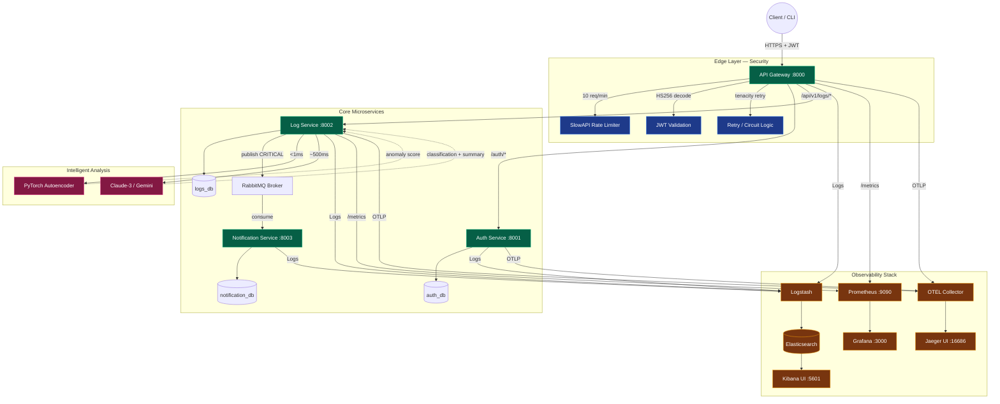
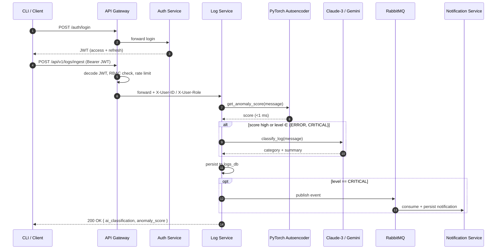
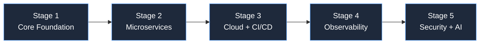

<div align="center">

# Log Intelligence Platform
### A Production-Grade Microservice Ecosystem for AI-Driven Log Security & Observability

**UYG414 — Special Topics in Computer Engineering · Final Project**

[](https://www.python.org/)
[](https://fastapi.tiangolo.com/)
[](https://www.docker.com/)
[](https://kubernetes.io/)
[](https://www.postgresql.org/)
[](https://www.rabbitmq.com/)
[](https://www.elastic.co/elastic-stack)
[](https://pytorch.org/)
[](https://www.anthropic.com/)
[](https://github.com/features/actions)

</div>

---

## Table of Contents

1. [The Problem](#1-the-problem)
2. [About This Project](#2-about-this-project)
3. [The Solution](#3-the-solution)
4. [Demo Flow](#4-demo-flow--what-it-actually-does)
5. [System Architecture](#5-system-architecture)
6. [Technology Stack](#6-technology-stack)
7. [Engineering Highlights](#7-key-engineering-highlights)
8. [Project Evolution — 5 Stages](#8-project-evolution--5-cumulative-stages)
9. [Live API Endpoints](#9-live-api-endpoints)
10. [Quick Start & Testing Guide](#10-quick-start--testing-guide)
11. [Repository Structure](#11-repository-structure)

---

## 1. The Problem

> Modern distributed systems generate **millions of log lines per day**. Buried inside that noise are the early signals of outages, breaches, and abuse — but humans cannot read them in time.

Engineering teams today face three painful realities:

| Pain Point | Impact |
| :--- | :--- |
| **Log Volume Explosion** | Critical errors get lost in millions of routine `INFO` lines. |
| **Reactive Security** | Threats are detected *after* damage is done — alerts fire post-breach. |
| **Tool Sprawl** | Teams juggle separate tools for logging, auth, alerting, and monitoring with no unified semantic context. |

**The cost?** Mean Time To Detect (MTTD) and Mean Time To Respond (MTTR) climb, while engineers drown in dashboards.

---

## 2. About This Project

> A semester-long engineering journey that grew a single Python script into a production-grade, AI-augmented platform — one stage at a time.

<table>
<tr>
<td width="33%" valign="top" align="center">

#### Course
**UYG414**
Special Topics in Computer Engineering

</td>
<td width="33%" valign="top" align="center">

#### Scope
**5 Homework Stages**
unified into one final platform

</td>
<td width="33%" valign="top" align="center">

#### Outcome
**4 Microservices**
12+ integrated technologies

</td>
</tr>
</table>

### What Was Built

The **Log Intelligence Platform** is a containerized ecosystem of independent FastAPI microservices that work together to **ingest, classify, secure, and visualize** logs from any distributed system. Every line of code, every architectural choice, every observability dashboard was added incrementally across five graded homework deliverables — and then merged into a single, coherent production-style platform.

### Project Goals

| Goal | How It’s Achieved |
| :--- | :--- |
| **Apply distributed systems theory** | Decompose into 4 independent services with isolated databases. |
| **Make security a first-class citizen** | JWT auth, RBAC, bcrypt, rate limiting, refresh-token rotation. |
| **Demonstrate practical AI/ML** | A two-tier pipeline: local PyTorch model + frontier LLM. |
| **Deliver real production tooling** | Docker, Kubernetes, GitHub Actions, ELK, Prometheus, Grafana, Jaeger. |
| **Be presentation-ready** | An interactive Rich-based CLI for live demos. |

### What Makes It Special

- **Hybrid AI**: A *fast lane* (local PyTorch model, <1 ms) pre-filters every log; a *slow lane* (Claude-3 / Gemini, ~500 ms) only runs on the suspicious ones.
- **End-to-end observability**: Every request emits a trace, a metric, and a structured log — all correlatable.
- **Cumulative design**: Each homework stage is preserved (`hw1/` → `hw5/`) so the *evolution* of the system is itself part of the deliverable.
- **No vendor lock-in for AI**: Swappable provider — Gemini and Claude are both supported, with graceful degradation if neither key is present.

---

## 3. The Solution

A **unified, AI-augmented microservice platform** that ingests logs from any service, performs **two-tier intelligent analysis** in real time, and surfaces only the signals that matter — with full security, observability, and DevOps tooling baked in.

### Core Idea: A Two-Tier AI Pipeline

```
                    ┌──────────────────────────────────────────┐
   Raw Log  ──────▶ │  Tier 1: PyTorch Autoencoder  (<1 ms)    │ ──▶ anomaly score
                    │  → instant structural anomaly scoring    │
                    └──────────────────┬───────────────────────┘
                                       │ if score high OR level ∈ {ERROR, CRITICAL}
                                       ▼
                    ┌──────────────────────────────────────────┐
                    │  Tier 2: Claude-3 / Gemini  (~500 ms)    │ ──▶ classification
                    │  → semantic root-cause classification    │     + summary
                    │  → cross-log threat pattern analysis     │     + severity
                    └──────────────────────────────────────────┘
```

This **fast/slow lane split** keeps p99 latency tight while reserving expensive LLM calls for logs that actually matter — combining the speed of local ML with the reasoning depth of a frontier model.

---

## 4. Demo Flow — What It Actually Does

A live walkthrough of the platform in 5 steps:

| # | Action | What Happens Behind the Scenes |
| :-: | :--- | :--- |
| 1 | User registers + logs in via CLI dashboard | `auth_service` issues signed JWT (access + refresh) |
| 2 | A microservice POSTs a log to `/api/v1/logs/ingest` | API Gateway validates JWT, enforces RBAC, rate limits, forwards |
| 3 | `log_service` runs **PyTorch Autoencoder** on the message | Anomaly score computed in <1 ms |
| 4 | If anomalous → **Claude-3** classifies root cause | Tagged: `DATABASE_ERROR`, `AUTH_ERROR`, `PERFORMANCE_ISSUE`, … |
| 5 | If `CRITICAL` → published to **RabbitMQ** | `notification_service` consumes & alerts asynchronously |

In parallel, **every** request emits OTEL traces (Jaeger), metrics (Prometheus → Grafana), and logs (Logstash → Elasticsearch → Kibana).

> **Suggested screenshots to add here for the presentation page:**
> - `docs/img/cli-dashboard.png` — the interactive Rich TUI main menu
> - `docs/img/kibana-logs.png` — Kibana showing live ingested logs
> - `docs/img/grafana-metrics.png` — Grafana dashboard with request rates
> - `docs/img/jaeger-trace.png` — a Jaeger trace spanning Gateway → Log Svc → AI

---

## 5. System Architecture


```mermaid
graph TD
    User((Client / CLI)) -->|HTTPS + JWT| Gateway[API Gateway :8000]

    subgraph "Edge Layer — Security"
        Gateway -->|10 req/min| SlowAPI[SlowAPI Rate Limiter]
        Gateway -->|HS256 decode| EdgeAuth[JWT Validation]
        Gateway -->|tenacity retry| Resilience[Retry / Circuit Logic]
    end

    subgraph "Core Microservices"
        Gateway -->|/auth/*| AuthSvc[Auth Service :8001]
        AuthSvc --> AuthDB[(auth_db)]

        Gateway -->|/api/v1/logs/*| LogSvc[Log Service :8002]
        LogSvc --> LogDB[(logs_db)]
        LogSvc -->|publish CRITICAL| Rabbit[RabbitMQ Broker]

        Rabbit -->|consume| NotifSvc[Notification Service :8003]
        NotifSvc --> NotifDB[(notification_db)]
    end

    subgraph "Intelligent Analysis"
        LogSvc -->|<1ms| Local[PyTorch Autoencoder]
        LogSvc -->|~500ms| Claude[Claude-3 / Gemini]
        Local -.->|anomaly score| LogSvc
        Claude -.->|classification + summary| LogSvc
    end

    subgraph "Observability Stack"
        LogSvc & AuthSvc & Gateway & NotifSvc -->|Logs| Logstash
        Logstash --> Elastic[(Elasticsearch)]
        Elastic --> Kibana[Kibana UI :5601]

        LogSvc & Gateway -->|/metrics| Prometheus[Prometheus :9090]
        Prometheus --> Grafana[Grafana :3000]

        Gateway & AuthSvc & LogSvc -->|OTLP| OTEL[OTEL Collector]
        OTEL --> Jaeger[Jaeger UI :16686]
    end

    classDef edge fill:#1e3a8a,stroke:#3b82f6,color:#fff
    classDef core fill:#065f46,stroke:#10b981,color:#fff
    classDef ai fill:#831843,stroke:#ec4899,color:#fff
    classDef obs fill:#78350f,stroke:#f59e0b,color:#fff
    class SlowAPI,EdgeAuth,Resilience edge
    class AuthSvc,LogSvc,NotifSvc,Gateway core
    class Local,Claude ai
    class Logstash,Elastic,Kibana,Prometheus,Grafana,OTEL,Jaeger obs
```

### Request Lifecycle (Sequence View)


```mermaid
sequenceDiagram
    autonumber
    participant C as CLI / Client
    participant G as API Gateway
    participant A as Auth Service
    participant L as Log Service
    participant ML as PyTorch Autoencoder
    participant AI as Claude-3 / Gemini
    participant Q as RabbitMQ
    participant N as Notification Service

    C->>G: POST /auth/login
    G->>A: forward login
    A-->>C: JWT (access + refresh)

    C->>G: POST /api/v1/logs/ingest (Bearer JWT)
    G->>G: decode JWT, RBAC check, rate limit
    G->>L: forward + X-User-ID / X-User-Role
    L->>ML: get_anomaly_score(message)
    ML-->>L: score (<1 ms)
    alt score high or level ∈ {ERROR, CRITICAL}
        L->>AI: classify_log(message)
        AI-->>L: category + summary
    end
    L->>L: persist to logs_db
    opt level == CRITICAL
        L->>Q: publish event
        Q->>N: consume + persist notification
    end
    L-->>C: 200 OK { ai_classification, anomaly_score }
```

---

## 6. Technology Stack

<table>
<tr>
<th align="left">Layer</th>
<th align="left">Technology</th>
<th align="left">Why It Was Chosen</th>
</tr>
<tr>
<td><b>Application</b></td>
<td>Python 3.11 · FastAPI · Pydantic · SQLAlchemy</td>
<td>Async-native, type-safe, fastest Python web stack available</td>
</tr>
<tr>
<td><b>Identity & Security</b></td>
<td>JWT (HS256) · bcrypt · RBAC · SlowAPI</td>
<td>Stateless auth, brute-force protection, fine-grained permissions</td>
</tr>
<tr>
<td><b>Data</b></td>
<td>PostgreSQL 16 (×3 isolated DBs)</td>
<td>One DB per service — no cross-service coupling</td>
</tr>
<tr>
<td><b>Messaging</b></td>
<td>RabbitMQ · aio-pika</td>
<td>Decoupled async fan-out for critical events</td>
</tr>
<tr>
<td><b>AI / ML</b></td>
<td>PyTorch (local Autoencoder) · Claude-3 / Gemini</td>
<td>Hybrid: cheap-fast local model + powerful semantic LLM</td>
</tr>
<tr>
<td><b>Observability</b></td>
<td>Elasticsearch · Logstash · Kibana · Prometheus · Grafana · Jaeger · OpenTelemetry</td>
<td>Full three-pillar visibility: logs + metrics + traces</td>
</tr>
<tr>
<td><b>Resilience</b></td>
<td>tenacity (retry) · health-checks · graceful AI fallback</td>
<td>System remains functional even when downstream APIs fail</td>
</tr>
<tr>
<td><b>DevOps</b></td>
<td>Docker (multi-stage) · Docker Compose · Kubernetes · GitHub Actions</td>
<td>Containerized, orchestrated, and CI/CD-validated on every push</td>
</tr>
<tr>
<td><b>Interface</b></td>
<td>Rich-based interactive CLI dashboard</td>
<td>Live demo-friendly TUI for the presentation</td>
</tr>
</table>

---

## 7. Key Engineering Highlights

<table>
<tr><td width="50%" valign="top">

#### Two-Tier AI Pipeline
Fast/slow lane: PyTorch Autoencoder pre-filters every log in **<1 ms**, then routes only suspicious entries to Claude-3 for semantic reasoning.

#### Stateless JWT + RBAC
API Gateway decodes tokens **locally** (no auth round-trip), injects `X-User-ID` / `X-User-Role` headers, and downstream services enforce `writer` / `reader` / `admin` permissions.

#### Asynchronous Event Architecture
Critical logs are published to RabbitMQ and consumed by a fully decoupled notification service — log ingestion never blocks on alerting.

</td><td width="50%" valign="top">

#### Three-Pillar Observability
Every request produces a **trace** (Jaeger), **metrics** (Prometheus/Grafana), and **structured logs** (Kibana) — correlatable end-to-end.

#### Defense-in-Depth Security
JWT + bcrypt + RBAC + per-IP rate limiting (10/min on auth, 100/min on logs) + refresh tokens with rotation + tenacity retries on every external call.

#### Production DevOps
Multi-stage Dockerfiles · Docker Compose orchestration · Kubernetes manifests · GitHub Actions CI running pytest + image builds on every push.

</td></tr>
</table>

---

## 8. Project Evolution — 5 Cumulative Stages

Each homework stage built directly on the previous, growing the system from a single API to a full production platform.


```mermaid
flowchart LR
    HW1[Stage 1<br/>Core Foundation] --> HW2[Stage 2<br/>Microservices]
    HW2 --> HW3[Stage 3<br/>Cloud + CI/CD]
    HW3 --> HW4[Stage 4<br/>Observability]
    HW4 --> HW5[Stage 5<br/>Security + AI]
    classDef s fill:#1e293b,stroke:#60a5fa,color:#fff
    class HW1,HW2,HW3,HW4,HW5 s
```

### Stage 1 — The Core Foundation
> **Goal:** Establish a robust, testable monolithic core.
- **4-Layer Clean Architecture** — Controllers → Services → Repositories → Models
- **Anthropic Claude integration** — automatic root-cause classification
- **PostgreSQL + SQLAlchemy ORM** — transactional log persistence

### Stage 2 — Distributed Microservices
> **Goal:** Decompose the monolith for fault isolation and team autonomy.
- **API Gateway** as a single secure entry point
- **RabbitMQ async messaging** for non-blocking critical alerts
- **JWT-based stateless authentication** across all services

### Stage 3 — Cloud Infrastructure & CI/CD
> **Goal:** Make it deployable, scalable, and automated.
- **Docker** multi-stage builds — minimal images, smaller attack surface
- **Kubernetes manifests** — Deployments, Services, ConfigMaps, PVCs
- **GitHub Actions pipeline** — automated tests + image validation per push

### Stage 4 — Observability & Reliability
> **Goal:** See everything, recover from anything.
- **ELK Stack** — centralized, searchable logs across all services
- **Prometheus + Grafana + Jaeger** — full metrics & distributed tracing
- **Self-healing** — health checks, tenacity retries, graceful degradation

### Stage 5 — Advanced Security & AI
> **Goal:** Harden the platform and shift from reactive to predictive.
- **Role-Based Access Control** — token-embedded roles propagated via headers
- **Distributed rate limiting** — DoS protection at the edge
- **PyTorch Autoencoder** — local ML for instant anomaly scoring
- **Predictive AI** — semantic threat pattern detection across log windows

---

## 9. Live API Endpoints

All traffic flows through the **API Gateway** at `http://localhost:8000`.

#### Authentication (public)
| Method | Path | Purpose |
| :--- | :--- | :--- |
| `POST` | `/auth/register` | Create user with role |
| `POST` | `/auth/login` | Obtain access + refresh tokens |
| `POST` | `/auth/refresh` | Rotate access token |
| `GET`  | `/auth/users/me` | Current user profile |

#### Logs (JWT required)
| Method | Path | Purpose |
| :--- | :--- | :--- |
| `POST` | `/api/v1/logs/ingest` | Submit log → triggers full AI pipeline (writer+) |
| `GET`  | `/api/v1/logs/` | Filter & paginate logs |
| `GET`  | `/api/v1/logs/{id}` | Fetch a specific log |
| `POST` | `/api/v1/logs/analyze` | AI incident summary over recent logs |
| `POST` | `/api/v1/logs/anomalies` | Hybrid ML + LLM threat detection |
| `GET`  | `/api/v1/metrics` | Platform statistics |
| `GET`  | `/api/v1/health` | Liveness + DB connectivity check |

---

## 10. Quick Start & Testing Guide

This section walks the platform from a fresh clone all the way to a fully tested, observable, AI-powered demo.

### 10.1 Prerequisites

| Tool | Minimum Version | Used For |
| :--- | :--- | :--- |
| **Docker Desktop** | 24.x | Running the entire stack |
| **Docker Compose** | v2 | Service orchestration |
| **Python** | 3.11+ | Running the CLI and pytest suite |
| **Git** | any | Cloning the repository |
| *(optional)* **kubectl + minikube/kind** | latest | Stage 3 Kubernetes test |
| *(optional)* **Gemini or Claude API key** | — | Live LLM analysis (system runs without it) |

> **Tip:** allocate **at least 6 GB RAM** to Docker — the ELK stack alone wants ~3 GB.

### 10.2 Clone & Configure

```bash
git clone https://github.com/<your-org>/special-topics.git
cd special-topics/project

cp .env.example .env
```

Then edit `.env` and set at least:

```env
JWT_SECRET_KEY="any-long-random-string-min-32-chars"
GEMINI_API_KEY=""            # optional — leave empty for graceful fallback
ANTHROPIC_API_KEY=""         # optional — leave empty for graceful fallback
```

> Without an AI key, the platform still runs end-to-end — AI calls return graceful `"UNKNOWN"` placeholders so the demo is never broken.

### 10.3 Boot the Full Stack (Docker Compose)

```bash
docker compose up --build
```

First boot pulls images and takes **2–3 minutes**. When healthy, all services expose:

| Service | URL | What to Check |
| :--- | :--- | :--- |
| API Gateway | http://localhost:8000/api/v1/health | Should return `{ "status": "ok" }` |
| Auth Service | http://localhost:8001/docs | Swagger UI |
| Log Service | http://localhost:8002/docs | Swagger UI |
| Notification Service | http://localhost:8003/docs | Swagger UI |
| Kibana | http://localhost:5601 | Discover → `logstash-*` index |
| Grafana | http://localhost:3000 | login `admin` / `admin` |
| Prometheus | http://localhost:9090 | Status → Targets, all `UP` |
| Jaeger | http://localhost:16686 | Services dropdown lists all 4 microservices |
| RabbitMQ | http://localhost:15672 | login `guest` / `guest` |

### 10.4 Smoke Test (cURL)

Run these from any terminal once the stack is up:

```bash
# 1. Register a writer
curl -X POST http://localhost:8000/auth/register \
  -H "Content-Type: application/json" \
  -d '{"username":"demo","email":"demo@test.com","password":"demo1234","role":"writer"}'

# 2. Login → grab access_token
TOKEN=$(curl -s -X POST http://localhost:8000/auth/login \
  -H "Content-Type: application/json" \
  -d '{"email":"demo@test.com","password":"demo1234"}' | jq -r .data.access_token)

# 3. Ingest a CRITICAL log → triggers ML + AI + RabbitMQ + notification
curl -X POST http://localhost:8000/api/v1/logs/ingest \
  -H "Authorization: Bearer $TOKEN" \
  -H "Content-Type: application/json" \
  -d '{"level":"CRITICAL","message":"Database connection refused","service_name":"orders"}'

# 4. Read it back
curl -H "Authorization: Bearer $TOKEN" http://localhost:8000/api/v1/logs/
```

A successful response in step 3 will include both `anomaly_score` (from PyTorch) and `ai_classification` (from the LLM, e.g. `DATABASE_ERROR`).

### 10.5 Test the Interactive CLI Dashboard (Recommended for the Demo)

```bash
cd project/cli
pip install -r requirements.txt
python main.py
```

You will see the Rich TUI banner and a 12-option menu:

| Key | Action | Verifies |
| :-: | :--- | :--- |
| `1` | Login | Auth + JWT issuance |
| `2` | Register | RBAC role assignment |
| `3` | Who Am I | Token forwarding through gateway |
| `4` | Ingest Log | Full ML + AI + DB pipeline |
| `5` | List Logs | Pagination + filters |
| `6` | AI Analysis | Claude/Gemini incident summary |
| `7` | Anomaly Detection | PyTorch + LLM hybrid scan |
| `8` | System Health | Cross-service liveness |
| `9` | Metrics | Counter / latency stats |
| `d` | **Run Demo** | **One-shot scripted attack scenario — best for presentation** |
| `c` | Config | Switch gateway URL |
| `q` | Quit | — |

> **For the live presentation:** press `d` after logging in. It auto-ingests a series of escalating logs (INFO → WARNING → ERROR → CRITICAL) so the audience can watch anomaly scores and AI classifications appear in real time.

### 10.6 Run the Automated Test Suite (pytest)

Each service ships with its own test directory. Run them all from the repo root:

```bash
# From project/
for svc in api_gateway auth_service log_service notification_service cli; do
  echo "── Testing $svc ──"
  (cd $svc && pip install -r requirements.txt && pytest -v)
done
```

| Test Module | What It Covers |
| :--- | :--- |
| `api_gateway/tests/test_main.py` | JWT decode, header injection, rate limiter, retry logic |
| `auth_service/tests/test_main.py` | Register / login, bcrypt, refresh-token rotation |
| `log_service/tests/test_main.py` | CRUD, AI mocking, RBAC enforcement |
| `log_service/tests/test_local_ml.py` | PyTorch Autoencoder anomaly scoring |
| `notification_service/tests/test_main.py` | RabbitMQ consumer + persistence |
| `cli/tests/test_cli.py` | `APIClient` happy-path + error paths |

**Continuous Integration:** every push to GitHub runs the same test matrix in `.github/workflows/` plus a Docker image build, so a green commit is a fully validated commit.

### 10.7 Visual Verification (For the Presentation)

After running the CLI demo (`d`), open these URLs to *show* the system working:

| Pillar | URL | What to Show |
| :--- | :--- | :--- |
| **Logs** | http://localhost:5601 | Kibana → Discover → filter `level:CRITICAL` |
| **Metrics** | http://localhost:3000 | Grafana → Log Service Dashboard → request rate spike |
| **Traces** | http://localhost:16686 | Jaeger → service `log-service` → recent trace spanning Gateway → ML → Claude |
| **Async** | http://localhost:15672 | RabbitMQ Management → `critical_logs` queue with consumed messages |

### 10.8 Optional — Test the Kubernetes Deployment

```bash
# Start a local cluster
minikube start --memory=6144 --cpus=4

# Apply manifests in order
kubectl apply -f project/k8s/config.yaml
kubectl apply -f project/k8s/infrastructure.yaml
kubectl apply -f project/k8s/services.yaml

# Watch pods come up
kubectl get pods -w

# Port-forward the gateway and re-run the smoke test
kubectl port-forward svc/api-gateway 8000:8000
```

### 10.9 Tear Down

```bash
docker compose down -v       # stop + remove volumes (clean slate)
minikube delete              # if you ran the K8s test
```

---

## 11. Repository Structure

```
special-topics/
├── hw1/ … hw5/              # Historical stage snapshots (graded deliverables)
├── project/                 # Latest unified version of the ecosystem
│   ├── api_gateway/         # Reverse proxy, JWT, rate limiting
│   ├── auth_service/        # User management, JWT issuance
│   ├── log_service/         # Core domain — ML + LLM pipeline
│   ├── notification_service/# Async RabbitMQ consumer
│   ├── cli/                 # Rich-based interactive TUI
│   ├── k8s/                 # Kubernetes manifests
│   ├── monitoring/          # Logstash / Prometheus / OTEL configs
│   ├── docker-compose.yml   # Full-stack orchestration
│   ├── reliability_report.md
│   └── security_report.md
└── .github/                 # CI/CD workflows
```

---

<div align="center">

### Built across 5 stages · 4 microservices · 12+ integrated technologies

**A unified demonstration of distributed systems, applied AI, secure design, and modern DevOps.**

</div>
