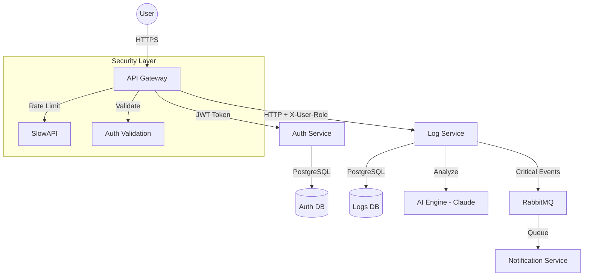

# HW#5 Security & AI Design Report

## 1. Advanced Security Implementation

### 1.1 Secure Authentication & RBAC
- **JWT-based Authentication**: Implemented via `auth_service` using `HS256` algorithm and `bcrypt` for secure password hashing.
- **Role-Based Access Control (RBAC)**: The API Gateway extracts roles from JWT claims and propagates them via `X-User-Role` headers. Downstream services (like `log_service`) use these headers to enforce permissions (e.g., `require_writer_role` for log ingestion).
- **Refresh Token Strategy**: Implemented refresh tokens with a 7-day TTL to allow secure session persistence without requiring frequent re-authentication.

### 1.2 Rate Limiting (Centralized & Per-Service)
- **API Gateway Rate Limiting**: Integrated `slowapi` at the gateway level.
- **Global Policy**: 10 requests per minute per IP for sensitive routes (e.g., `/auth/register`) to prevent brute-force attacks.
- **Burst Handling**: The limiter ensures that spikes in traffic from a single source do not degrade service for other tenants.

### 1.3 Secure Secrets Management
- **Environment Separation**: Secrets are handled via `.env` files and environment variables, ensuring no sensitive data is hardcoded in the repository.
- **Production Best Practices**: In the Kubernetes deployment (Stage 3), secrets are managed via `k8s-secrets` which are encrypted at rest in the etcd store. For production environments, we recommend integration with **AWS Secrets Manager** or **HashiCorp Vault**.

---

## 2. AI Functionality: Smart Security Observation

### 2.1 Feature: AI-Powered Anomaly Detection
- **Model**: Anthropic Claude-3 (Haiku/Sonnet)
- **Functionality**: A specialized endpoint `/api/v1/logs/anomalies` that aggregates the last 100 log entries across all services and performs semantic analysis to detect:
    - **Security Threats**: Patterns of brute-force login attempts or injection signatures.
    - **Performance Degradation**: Increasing latency trends or cascading failures.
    - **Unusual Patterns**: Service communication anomalies or mass data exports.

### 2.2 Feature: Intelligent Log Classification
- Every error or critical log is automatically analyzed on ingestion.
- The AI classifies the root cause (e.g., `DATABASE_ERROR`, `AUTH_ERROR`) into the database, allowing for smart filtering and alerting.

---

## 3. Updated Architecture Diagram

## 4. AI Feature Demonstration
To demonstrate the anomaly detection:
1. Ingest several logs simulating a failed login spree.
2. Call `POST /api/v1/logs/anomalies` via the API Gateway.
3. The response will contain a structured analysis of the potential threat and a severity score.
